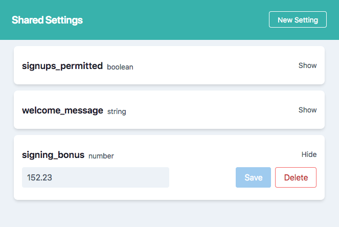
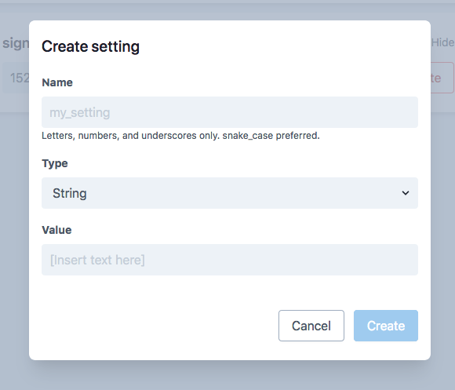

# SharedSettingsUI

Adds a simple admin interface for the [Elixir SharedSettings][ss-ex] library.




Acts as a wrapper for the base [SharedSettings UI][ss-ui-base].

## Installation

You are required to install and configure the base [Elixir SharedSettings][ss-ex] library first.

```elixir
def deps do
  [
    {:shared_settings_ui, "~> 0.2.0"}
  ]
end
```

### Phoenix

Once installed and configured, add the following to your router:

```elixir
scope path: "/shared-settings" do
  # Namespace must be the full route's namespace w/ no leading or trailing slash
  forward "/", SharedSettings.UI.Router, namespace: "shared-settings"
end
```

As-is, this would be accessible to the outside world so creating a pipeline that runs through your existing auth system or basic auth will be required.

## License

MIT License

Copyright 2020

Permission is hereby granted, free of charge, to any person obtaining a copy of this software and associated documentation files (the "Software"), to deal in the Software without restriction, including without limitation the rights to use, copy, modify, merge, publish, distribute, sublicense, and/or sell copies of the Software, and to permit persons to whom the Software is furnished to do so, subject to the following conditions:

The above copyright notice and this permission notice shall be included in all copies or substantial portions of the Software.

THE SOFTWARE IS PROVIDED "AS IS", WITHOUT WARRANTY OF ANY KIND, EXPRESS OR IMPLIED, INCLUDING BUT NOT LIMITED TO THE WARRANTIES OF MERCHANTABILITY, FITNESS FOR A PARTICULAR PURPOSE AND NONINFRINGEMENT. IN NO EVENT SHALL THE AUTHORS OR COPYRIGHT HOLDERS BE LIABLE FOR ANY CLAIM, DAMAGES OR OTHER LIABILITY, WHETHER IN AN ACTION OF CONTRACT, TORT OR OTHERWISE, ARISING FROM, OUT OF OR IN CONNECTION WITH THE SOFTWARE OR THE USE OR OTHER DEALINGS IN THE SOFTWARE.

[ss-ex]: https://github.com/kieraneglin/shared-settings-ex
[ss-ui-base]: https://github.com/kieraneglin/shared-settings-ui
